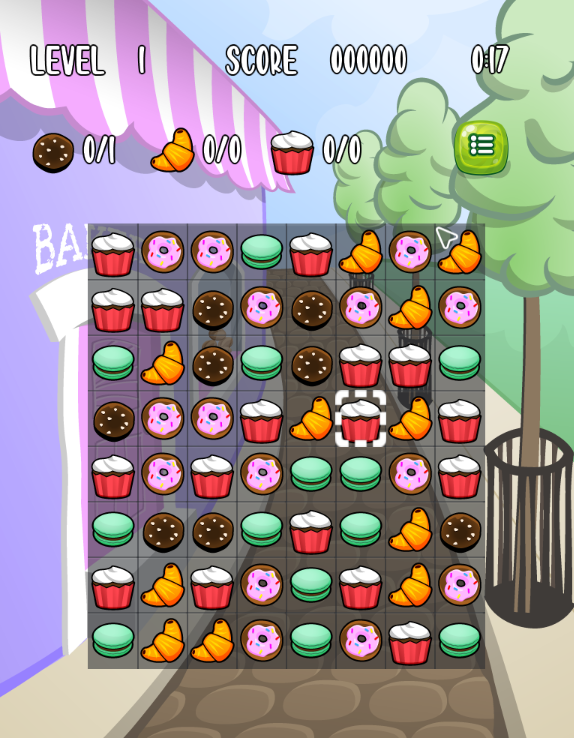

# Sweet Crush
Sweet Crush is an open source, cross-platform Match-3 game.

## Features
* Match3 game mechanics
* Cartoon graphics
* Music and sound effects
* English, Spanish and Italian localization

## Credits
* Code by [Stefano Lanza](steflanz@gmail.com)
* Graphics by [GameArtGuppy](https://www.gameartguppy.com)
* Music by [Patrick De Arteaga](https://patrickdearteaga.com)

## Requirements
* C++ 17 compiler
* OpenGL 3.1+ on desktop
* OpenGL ES 3.0+ on mobile

## Installation
* Clone the github repository to a folder (REPO in the following instructions) on your local machine
* For a Windows build
  * Install the latest release of [premake5](https://premake.github.io/download)
  * For convenience, precompiled libraries of SDL2, SDL_mixer and SDL_image, for 32 and 64 bits, are part of the repository
  * cd REPO
  * Run `premake5 vs2022`. You can target previous versions of Visual Studio (e.g. `vs2019`) if you do not have the 2022 one.
    This command generates a Visual Studio solution
  * Open build/vs2022/SweetCrush.sln in Visual Studio
  * Choose the build configuration (Release or Debug, 32 bits or 64 bits)
  * Build the solution
  * The executable SweetCrush.exe is built inside the bin folder
* For a linux build
  * Install the latest release of [premake5](https://premake.github.io/download)
  * Install the SDL2 development package  
  sudo apt-get install libsdl2-dev
  * Install the SDL_image development package  
   `sudo apt-get install libsdl2-image-dev`
  * Install the SDL_mixer development package   
  `sudo apt-get install libsdl2-mixer-dev`
  * cd REPO
  * Run `premake5 gmake`. This generates makefile(s) under build/gmake
  * cd build/gmake
  * Run make with the desired configuration e.g.  `make config=release_x64`
  * The executable SweetCrush is built inside the bin folder
* For an Android build
  * Open SweetCrush_android.sln in Visual Studio 2022
  * Select the build configuration (Release or Debug configuration, ARM or x86 depending on your target device)
  * Build the solution
  * In Visual Studio, select Tools/Android/Android Adb Command Prompt
  * In the command prompt, go to the REPO/android folder
  * Run signAPKs.bat to sign the ARM and x86 APKs built with the Release configuration
  * Copy the signed APK (either the x86 or ARM one) to your device, install it and play

## Technical Info
* Tested on Linux Mint 20.2 Cinnamon, Windows 10, Windows 11 and various Android devices and emulators.
* Third party libraries
  * SDL 2.0.18
  * SDL Mixer 2.0.5
  * SDL Image 2.0.6
  * inih - simple .INI file parser

## Future Work
* New game mechanics
* More animations, power ups and sound effects
* Scoreboard
* macOS and iOS ports

## Contributions
I would need help on the following:
* Design new game mechanics
* Port the game to macOS and iOS
* Test build on other Linux distros
